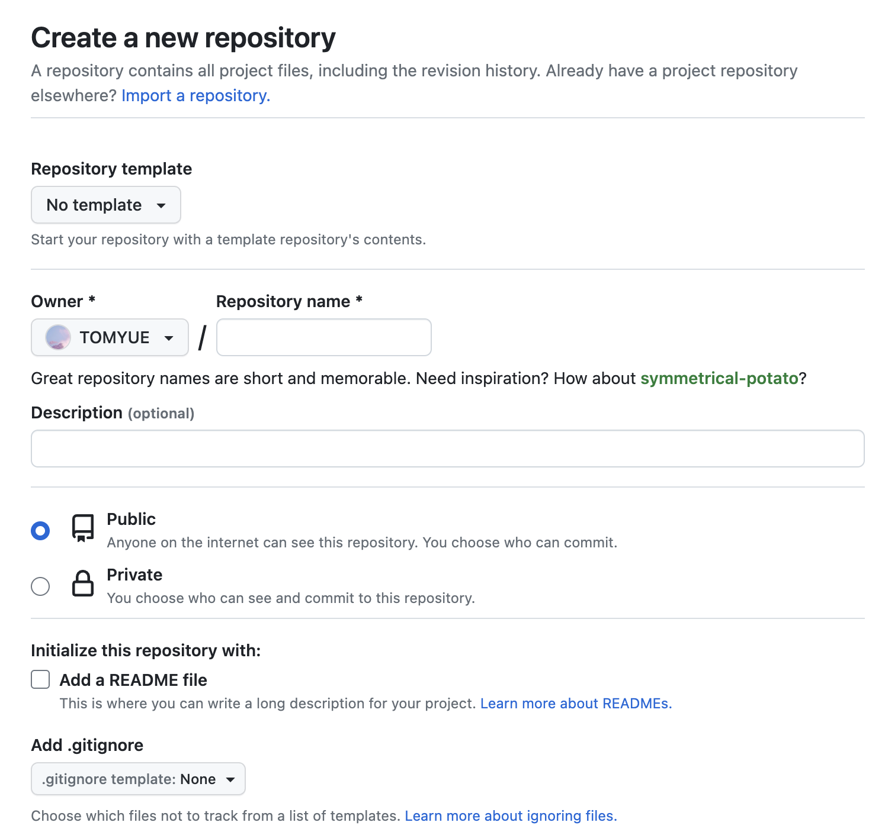
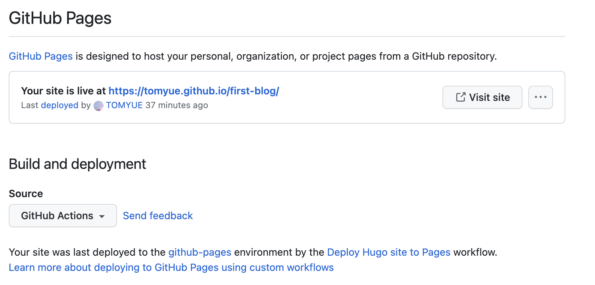
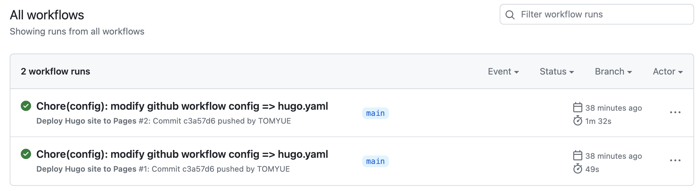
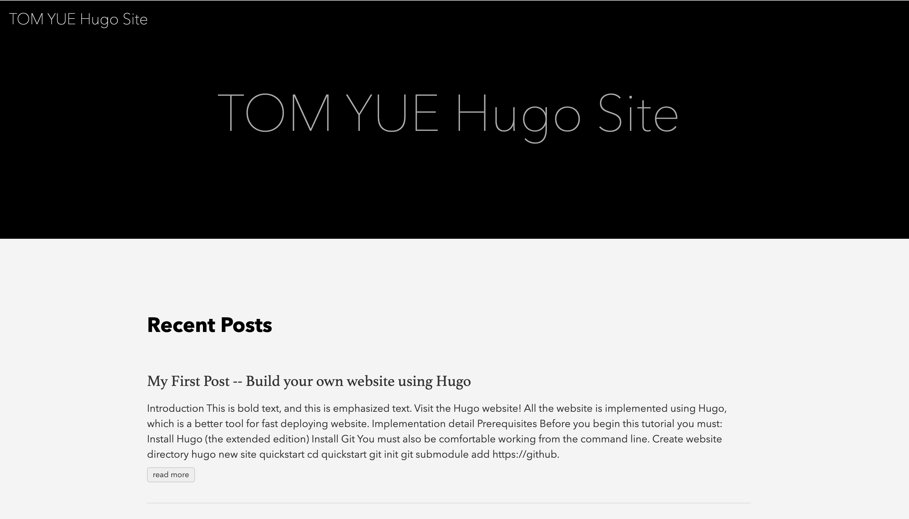

## Introduction 

This is **bold** text, and this is *emphasized* text. Visit the [Hugo](https://gohugo.io) website!

All the website is implemented using Hugo, which is a better tool for fast deploying website.


## Implementation detail

### Prerequisites 

Before you begin this tutorial you must:

1. [Install Hugo](https://gohugo.io/installation/) (the extended edition)
2. [Install Git](https://git-scm.com/book/en/v2/Getting-Started-Installing-Git)

You must also be comfortable working from the command line.

### Create website directory

```bash
hugo new site quickstart
cd quickstart
git init
git submodule add https://github.com/theNewDynamic/gohugo-theme-ananke themes/ananke
echo "theme = 'ananke'" >> config.toml
hugo server
```

View your site at the URL displayed in your terminal. Press `Ctrl + C` to stop Hugo’s development server.


### Add content

```bash
hugo new posts/my-first-post.md
```

Hugo created the file in the `content/posts` directory. Open the file with your editor.

```bash
---
title: "My First Post"
date: 2022-11-20T09:03:20-08:00
draft: true
---
```


### Create remote github repo




### Add local repo to remote 

```bash
git remote set-url origin git@github.com:TOMYUE/first-blog.git
git pull --rebase
git pull --rebase origin main # add branch track
git add .
git commit -am "Feat: add github actions workflow, generate static website"
git push -u origin main
```


### Add github actions




### Active github actions




### Open site


